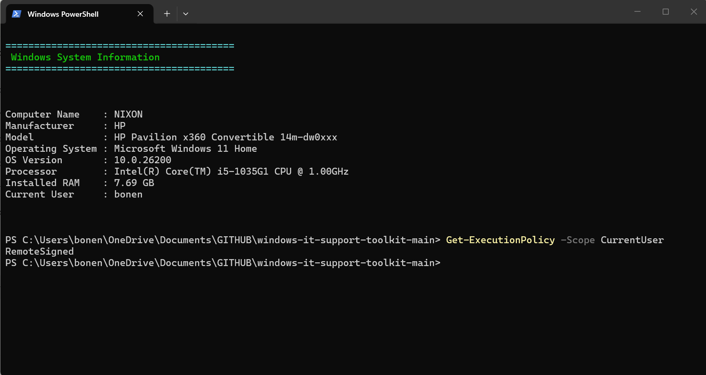
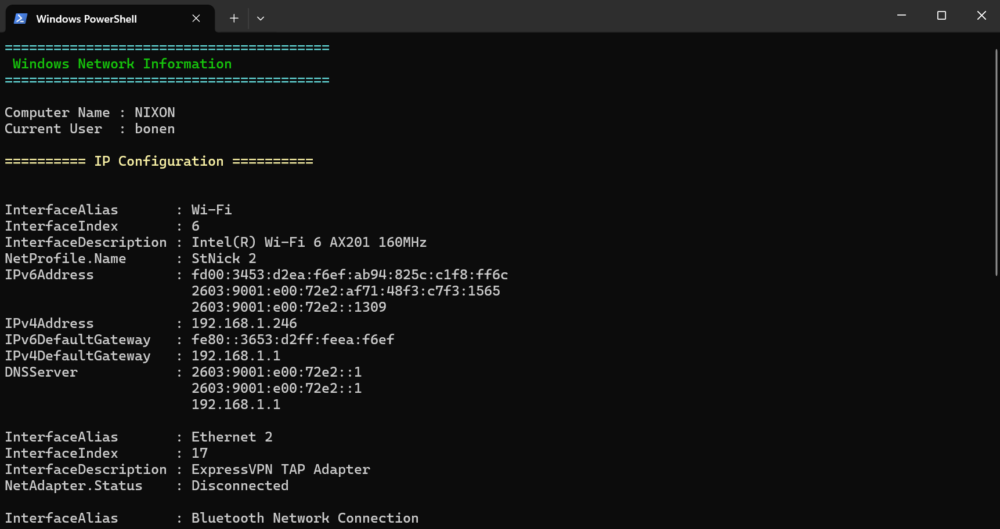
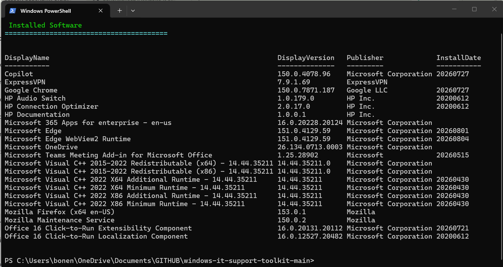

# Windows IT Support Toolkit

## Overview

This repository showcases hands-on Windows administration, PowerShell automation, and IT support projects designed to demonstrate practical skills used in enterprise environments.

The toolkit includes PowerShell scripts for common administrative tasks, troubleshooting documentation, execution guides, and verified script demonstrations.

---

## Table of Contents

- [Overview](#overview)
- [Repository Structure](#repository-structure)
- [PowerShell Scripts](#powershell-scripts)
- [Troubleshooting Guides](#troubleshooting-guides)
- [Script Demonstrations](#script-demonstrations)
- [Project Goals](#project-goals)
- [Skills Demonstrated](#skills-demonstrated)
- [Technologies Used](#technologies-used)
- [Repository Status](#repository-status)
- [Future Improvements](#future-improvements)
- [About Me](#about-me)

---

## Repository Structure

```text
windows-it-support-toolkit/
│
├── PowerShell/
│   ├── system-info.ps1
│   ├── network-info.ps1
│   ├── disk-cleanup.ps1
│   ├── running-services.ps1
│   ├── installed-software.ps1
│   ├── event-log-review.ps1
│   ├── windows-update-check.ps1
│   └── README.md
│
├── Troubleshooting/
│   ├── WiFi-Troubleshooting.md
│   ├── Printer-Troubleshooting.md
│   ├── Windows-Update-Troubleshooting.md
│   ├── Outlook-Troubleshooting.md
│   ├── BSOD-Troubleshooting.md
│   ├── Slow-Computer-Troubleshooting.md
│   ├── Login-Account-Troubleshooting.md
│   └── README.md
│
├── Screenshots/
│   ├── system-info.png
│   ├── network-info.png
│   ├── disk-cleanup.png
│   ├── running-services.png
│   ├── installed-software.png
│   ├── event-log-review.png
│   ├── windows-update-check.png
│   └── README.md
│
├── HOW-TO-RUN.md
├── LICENSE
└── README.md
```

---

# PowerShell Scripts

📂 **Folder:** [`PowerShell`](./PowerShell)

This repository includes PowerShell scripts commonly used by IT Support Specialists, Desktop Support Technicians, and Systems Administrators.

| Script | Purpose |
|---------|---------|
| `system-info.ps1` | Displays Windows system information |
| `network-info.ps1` | Displays network configuration details |
| `disk-cleanup.ps1` | Removes temporary Windows files |
| `running-services.ps1` | Displays currently running Windows services |
| `installed-software.ps1` | Lists installed software from the Windows Registry |
| `event-log-review.ps1` | Displays recent Windows System events |
| `windows-update-check.ps1` | Checks the Windows Update service status |

---

# Troubleshooting Guides

📂 **Folder:** [`Troubleshooting`](./Troubleshooting)

This repository also contains troubleshooting documentation covering common Windows support scenarios including:

- Wi-Fi Connectivity
- Printer Issues
- Windows Update
- Microsoft Outlook
- Blue Screen (BSOD)
- Slow Computer Performance
- Login & Account Issues

---

# Script Demonstrations

📂 **Folder:** [`Screenshots`](./Screenshots)

The screenshots below demonstrate successful execution of the PowerShell scripts included in this project.

## Windows System Information



---

## Network Information



---

## Running Windows Services


---

## Installed Software



---

## Windows Event Log Review


---

## Windows Update Service Status


---

## Disk Cleanup


---

# Project Goals

This project was created to:

- Demonstrate Windows administration skills
- Practice PowerShell scripting
- Build a professional IT portfolio
- Document common help desk troubleshooting procedures
- Showcase technical documentation skills

---

# Skills Demonstrated

- Windows Administration
- PowerShell Automation
- Windows Networking
- Windows Services
- Windows Registry
- Event Viewer
- System Diagnostics
- Technical Troubleshooting
- Technical Documentation
- Git & GitHub

---

# Technologies Used

- Windows 10 / Windows 11
- Windows PowerShell 5.1
- Windows Management Instrumentation (WMI/CIM)
- Windows Registry
- Windows Services
- Event Viewer
- Microsoft 365
- Git
- GitHub

---

# Repository Status

| Component | Status |
|-----------|--------|
| PowerShell Scripts | ✅ Complete |
| Troubleshooting Guides | ✅ Complete |
| Documentation | ✅ Complete |
| Screenshots | ✅ Complete |
| Testing | ✅ Complete |

---

# Future Improvements

- Export PowerShell reports to CSV
- Generate HTML reports
- Add logging functionality
- Support command-line parameters
- Expand troubleshooting documentation
- Add additional Windows administration scripts

---

# About Me

Hi, I'm **Nixon Bone**.

I hold a Bachelor of Science in Information Technology with a concentration in Cybersecurity and have professional experience in technical support. I enjoy building hands-on IT projects that demonstrate practical Windows administration, automation, troubleshooting, networking, and scripting skills.

## Connect with Me

- **LinkedIn:** https://linkedin.com/in/nixon-bone-6abab2374
- **GitHub:** https://github.com/Bonenixon0824
